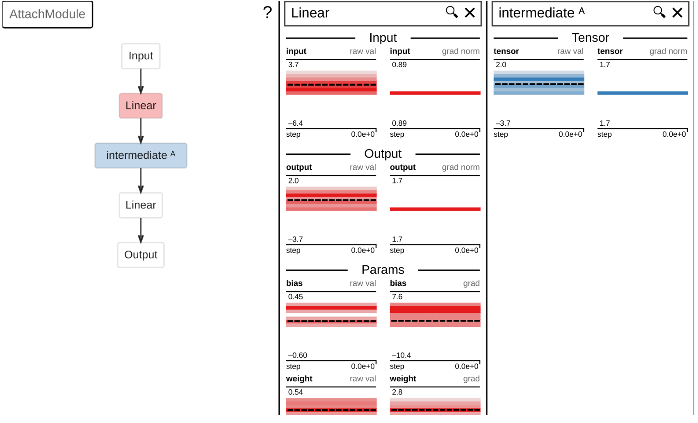
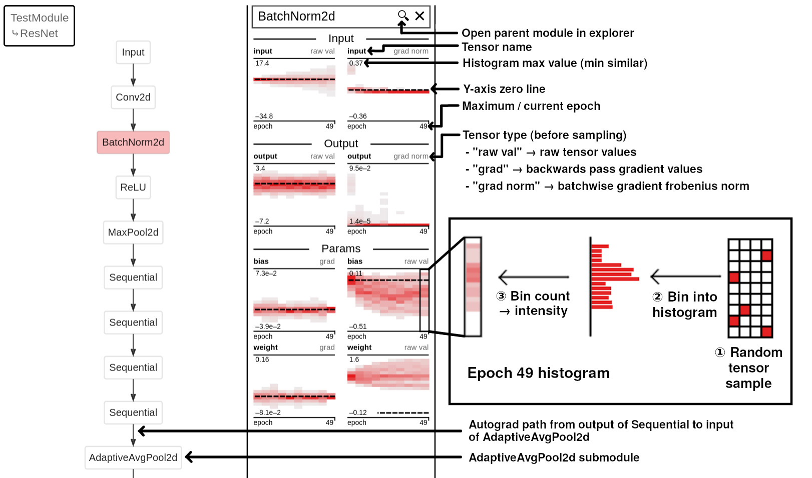

<p align="center">

</p>

<div align="center">

  <a href=""></a>
  <a href=""></a>
  <a href=""></a>
  <a href="https://github.com/spfrommer/torchexplorer/blob/main/LICENSE"></a>

</div>

<p align="center">
<em> Made by <a href="https://sam.pfrommer.us/">Samuel Pfrommer</a> as part of <a href="https://www2.eecs.berkeley.edu/Faculty/Homepages/sojoudi.html">Somayeh Sojoudi's group</a> at Berkeley. </em>
</p>

<p align="center">
  
</p>

<p align="center">
<em> <a href="https://api.wandb.ai/links/spfrom_team/8qqsxx9f">Try it yourself.</a>  </em>
</p>

Curious about what's happening in your network? TorchExplorer is a simple tool that allows you to interactively inspect the inputs, outputs, parameters, and gradients for each `nn.Module` in your network during training. It integrates with [weights and biases](https://wandb.ai/site) and can also operate locally as a standalone solution. If your use case fits (see limitations below), it's very simple to try:

```python
torchexplorer.setup() # Call once before wandb.init(), not needed for standalone
wandb.init()

model = ...

torchexplorer.watch(model, backend='wandb') # Or 'standalone'

# Training loop...
```

### Install
Installing requires one external `graphviz` dependency, which should be available on most package managers.

```bash
sudo apt-get install libgraphviz-dev graphviz
pip install torchexplorer
```
For Mac, `brew install graphviz` should suffice. If the `pygraphviz` wheel build fails because it can't find `Python.h`, you must install the python header files as described [here](https://stackoverflow.com/a/22077790/4864247).

### Usage

For more examples, see `/tests` and `/examples`.

_Examine model structure._ TorchExplorer's interactive view of the model structure is also useful in its own right (without the histogram bells-and-whistles). Here's a self-contained example for how to get an interactive view of a ResNet18. Mousing over a particular node reveals input/output tensor shapes and Module parameters. Get a feel for what this looks like [with an interactive demo](https://api.wandb.ai/links/spfrom_team/8qqsxx9f).
```python
import torch
import torchvision
import torchexplorer

model = torchvision.models.resnet18(pretrained=False)
dummy_X = torch.randn(5, 3, 32, 32)

# Only log input/output and parameter histograms, if you don't want even these set log=[].
torchexplorer.watch(model, log_freq=1, log=['io', 'params'], backend='standalone')
# Do one forwards and backwards pass
model(dummy_X).sum().backward()
# Your model will be available at http://localhost:5000
```

_Visualize intermediate tensors._ TorchExplorer automatically captures any Module inputs/outputs. Using [torchexplorer.attach](https://spfrommer.github.io/torchexplorer/#torchexplorer.attach), you can also log any intermediate tensors to the interface.

```python
import torch
from torch import nn
import torchexplorer

class AttachModule(nn.Module):
    def __init__(self):
        super().__init__()
        self.fc1 = nn.Linear(10, 10)
        self.fc2 = nn.Linear(10, 10)

    def forward(self, x):
        x = self.fc1(x)
        x = torchexplorer.attach(x, self, 'intermediate')
        return self.fc2(x)

model = AttachModule()
dummy_X = torch.randn(5, 10)
torchexplorer.watch(model, log_freq=1, backend='standalone')
model(dummy_X).sum().backward()
# Your model will be available at http://localhost:5000
```

<p align="center">
  
</p>

_More debugging use cases._ TorchExplorer is meant to be a general-purpose tool to see what's happening in your network—somewhat analagous to an oscilloscope in electronics. This section lists some potential use cases.

1. Checking if your model has vanishing / exploding gradients.
2. Checking if inputs to a particular module are nicely distributed (if not, throw in a normalization layer).
3. Catching bugs like using a `ReLU` nonlinearity as the final layer when module outputs could potentially be negative.
4. For multiple submodules whose outputs are combined, checking if gradients are flowing more to one or the other.
5. If a module takes multiple inputs, seeing which input is more important by the relative grad norm size.
6. Ensuring that latent space / embedding distributions look healthy (e.g., VAE latents are approximately normal).
7. Using `torchexplorer.attach` to see whether gradients are mainly flowing through skip connections or the main network path.

## User interface

<p align="center">
  
</p>

### Explorer
The left-hand panel contains a module-level graph of your network architecture, automatically extracted from the autograd graph. Clicking on a module will open its "internal" submodules. To return to a parent module, click on the appropriate element in the top-left expanding list.

_Nodes._ A node in the explorer graph is either a) an input/output placeholder for the visualized module, or b) a specific invocation of a submodule of the visualized module. If the visualized module has multiple inputs to its `forward` function, these will appear as multiple nodes ("Input 0", "Input 1", ...). A similar logic applies to outputs. All other nodes represent a distinct submodule invocation. This means that if a particular submodule is called twice in one forwards pass, these two invocations show up separately in the explorer graph. Their histograms and "internal" submodules will also be distinct.

_Edges._ An edge between two nodes means that there exists a autograd trace from some output of the parent node to some input of the child mode. **The number of incoming / outgoing edges to a node is unrelated to how many inputs/outputs the `forward` function takes.** To illustrate this, let's consider a `Linear` node with two incoming edges from two distinct parent nodes. This can arise if, say, the outputs of the parent modules are added together and then passed to the single `forward` function input. Conversely, consider a `TransformerEncoderLayer` node, which accepts multiple inputs. There may still only be one incoming edge from a parent module, if all the inputs to the `TransformerEncoderLayer` are computed from this source.

_Tooltips._ Mousing over explorer graph nodes displays a helpful tooltip. The first few lines summarize the shapes of the input / output tensors, recorded once from the first forwards pass through the network. The subsequent lines parse key information from `module.extra_repr()`. This string parsing is designed around common PyTorch `extra_repr()` implementations (e.g., `nn.Conv2d`). The string is first split on commas, with each resulting string becoming one row in the tooltip. If a resulting substring is of the form "{key}={value}", these become the key and value pairs for the tooltip. Otherwise the entire string is treated as a value with an empty key, visualized using a dash. This occurs for the `in_channels` and `out_channels` attributes for `Conv2d`.

### Panels
To inspect a module in more detail, just drag and drop it into one of the columns on the right. The histogram colors don't represent anything intrinsically—they're just to help identify in the explorer which modules are being visualized.

### Histograms
Each vertical "slice" of a histogram encodes the distribution of values at the corresponding x-axis time. The y-axis displays the minimum / maximum bounds of the histogram. Completely white squares mean that no data fell in that bin. A bin with one entry will be shaded light gray, with the color intensifying as more values fall in that bin (this encodes the "height" of the histogram). The dashed horizontal line is the $y=0$ line.

> [!NOTE]
> The tensors populating histograms are processed in two ways. First, for performance reasons they are randomly subsampled according to the `sample_n` parameter. This is 100 by default, and passing `None` will disable sub-sampling. Note that this sampling means that histograms that should be the same may look slightly different (e.g., output of parent node and input of child node). Second, a fraction of the most extreme values from the median are rejected to prevent outliers from compressing the histogram. This fraction is 0.1 by default, and can be disabled by passing 0.0 to the `reject_outlier_propertion` parameter.


For the following explanations, I'll be referencing this module:
```python
class TestModule(nn.Module):
    def __init__(self):
        super().__init__()
        self.fc = nn.Linear(20, 20)
        self.activation = nn.ReLU()

    def forward(self, x):
        x1 = self.fc(x)
        x2 = self.activation(x1)
        return x2  
```

_Input/output histograms._ These histograms represent the values passed into and out of the module's `forward` method, captured using hooks. For instance, if we are visualizing the `fc` layer in the above `TestModule`, the `input 0` histogram will be the histogram of `x`, and the `output 0` histogram will be the histogram of `x1`. If `fc` accepted two inputs `self.fc(x, y)`, then the histogram would show `input 0` and `input 1`. Note that the `input 0` histogram on the `activation` module will look very close to the `output 0` histogram on the `fc` module, with some small differences due to random sampling.

_Input/output gradient norm histograms._ These histograms capture tensor gradients from `backward` passes through the module. Unlike parameter gradients, we record here the $\ell_2$-norm of the gradients, averaged over the batch dimension. This means that if the gradient of the loss with respect to the module input is of dimension $b \times d_1 \times d_2$, we first flatten to a $b \times (d_1 \cdot d_2)$ vector and take the row-wise norm to get a length $b$ vector. These values then populate the histogram. For the `fc` layer in the above example, `input 0 (grad norm)` would apply this procedure to the gradient of the loss with respect to `x`, while `output 0 (grad norm)` would apply this procedure to the gradient of the loss with respect to `y`.

_Parameter histograms._ After the input/output histograms are extracted, all submodules will have their immediate parameters (`module._parameters`) logged as histograms. Note that this is not the same as `module.parameters()`, which would also recurse to include all child parameters. Some modules (particularly activations) have no parameters and nothing will show up in the interface. For instance, `TestModule` above has no trainable immediate parameters; `fc` will have `weight` and `bias` parameters; and `activation` will again have nothing.

_Parameter gradient histograms._ After the `backward` call is completed, each parameter will have a `.grad` attribute storing the gradient of the loss with respect to that parameter. This tensor is directly passed to the histogram. Unlike the input/output gradients, no norms are computed.

## API

API documentation is available [here](https://spfrommer.github.io/torchexplorer/). For wandb training, make sure to call `torchexplorer.setup()` before `wandb.init()`.

## Features and limitations

Notes on some corner cases. If something isn't covered here, feel free to open a GitHub issue.

### Supported

1. Performing multiple invocations of the same module is supported. Inputs/outputs will be displayed separately for each invocation, but the parameters and parameter gradients will of course be shared. So something like this should work:
```python
class TestModule(nn.Module):
    def __init__(self):
        super().__init__()
        self.fc = nn.Linear(20, 20)
        self.activation = nn.ReLU()

    def forward(self, x):
        x = self.activation(x)
        x = self.fc(x)
        x = self.activation(x)
        return x  
```
2. Nondifferentiable operations which break the autograd graph are permissible and should not cause a crash. However, the resulting module-level graph will be correspondingly disconnected.
3. Multiple inputs and outputs will display correctly (i.e., "Input 0", "Input 1", ...)
4. Invoking `.forward()` multiple times in a single step before backpropping is supported, but you must pass `delay_log_multibackward=True` (disabled by default). So the following pseudocode should work:
```python
torchexplorer.watch(module, delay_log_multibackward=True)

# ...
# Within a training loop step:
y_hat1 = module(X1)
y_hat2 = module(X2)
loss = (yhat1 - y1).abs().sum() + (yhat2 - y2).abs().sum()
loss.backward()
```
You'll see the superposition of the input/output histograms and input/output gradient histograms across the calls in the interface.

### Unsupported

1. All logging is disabled while the model is in `eval` mode, and any `forward` calls in this state are ignored completely.
2. **Recursive operations are not supported,** and **anything which dynamically changes the module-level control flow over training is not supported**. For instance, something like this isn't permissible:
```python
if x > 0:
    return self.module1(x)
else:
    return self.module2(x)
```
3. **Inplace operations are not supported** and should be corrected or filtered (see "Common errors" below).
4. Keyword tensor arguments to the `forward` method are not supported. Only positional arguments will be tracked. Behavior for keyword tensor arguments is untested as of now.
5. The tool isn't usable in the "Workspace" section of wandb when multiple runs are selected. To inspect a model, you must first open the specific run that you want in wandb. 
6. Stopping and resumption of training runs is untested.

### Other notes

1. When invoking a module, **don't use the `module.forward(x)` method**. Always call the forward method as `module(x)`. The former does not call the hooks that `torchexplorer` uses.
2. Histograms will only be updated during _training_, not validation. This is directly checked using `module.training`. This means that if your validation dataset has a different distribution than your training dataset, what you see in the tool might not tell you what's going on during validation.

## Common errors

This section includes some errors that I've run into. For something not covered here, feel free to open a GitHub issue.


**1. Inplace operations in the computational graph**
 
```
RuntimeError: Output 0 of BackwardHookFunctionBackward is a view and is being modified inplace...
```

This indicates that an inplace operation is occurring somewhere in the computational graph, which messes with the input/output gradient capturing (`io_grad`) feature. This commonly comes from inplace activations (e.g. `nn.ReLU(inplace=True)`), or residual inplace additions (e.g. `out += identity`). If you don't care about gradients you can just omit `'io_grad'` in `log` argument to the `watch` function. Otherwise, there are two additional tools available. You can use the `disable_inplace` argument to automatically turn off the `inplace` flag on all activations. If this still doesn't cut it, you must figure out what submodules are doing inplace operations and either manually fix them or pass those classes to the `ignore_io_grad_classes` argument. For example, the `BasicBlock` in the torchvision resnet implementation has an inplace residual connection. The `ReLU` activations in the resnet also have `inplace=True`. So we would do the following:

```python
model = torchvision.models.resnet18(pretrained=False)
watch(
    model,
    disable_inplace=True,
    ignore_io_grad_classes=[torchvision.models.resnet.BasicBlock]
)
```

**2. Weights and biases chart glitches**
```
"No data available." in the Custom Chart.
```

This occasionally shows up for me in the weights and biases interface and seems to be a difficult-to-reproduce bug in their custom charts support. Sometimes waiting fixes it. If possible, just restarting training when you notice this. Also, make sure that your browser is up-to-date. Updating Chrome to the latest version fixed this for me completely.

```
"Something went wrong..." and Google Chrome crashes.
```

It happens occasionally that the wandb website crashes with torchexplorer active. Reloading the page seems to always work. Again, this was completely fixed for me when I updated Chrome to the latest version.

**3. Graphviz overflow errors**
```
"Trapezoid overflow" error in the graphviz call.
```

This is a [known bug](https://github.com/ellson/MOTHBALLED-graphviz/issues/56) in Graphviz 2.42.2, an ancient version which is still the default on most package managers. If you're getting this error, you can fix it by installing a [newer release](https://gitlab.com/graphviz/graphviz/-/releases).

**4. Too many open files**
```
OSError: [Errno 24] Too many open files: b'/proc'
...
wandb: WARNING Failed to cache... too many open files
```

This is a [known bug](https://github.com/wandb/wandb/issues/2825) in wandb when uploading many tables. The only workaround I have for now is to modify the `ulimit` from the default of `1024` to `50000` by calling `torchexplorer.setup()` before `wandb.init()`. You can also try increasing `log_freq` so that fewer tables are logged. If you're still getting issues, you might have to edit `/etc/security/limits.conf` as [described here](https://unix.stackexchange.com/a/691947).

## Related tools
A partial list of some related tools. The first section concerns visualizing model structure, and the second section concerns visualizing parameters/activations during training. TorchExplorer combines these in an interactive way. TorchExplorer also stands out by only showing nested submodules if you click into a submodule, keeping the interface a little cleaner in my opinion.

_Model structure visualization._
1. [netron](https://github.com/lutzroeder/netron)
2. [torchviz](https://github.com/szagoruyko/pytorchviz)
3. [hiddenlayer](https://github.com/waleedka/hiddenlayer)
4. [torchview](https://github.com/mert-kurttutan/torchview)
5. [plotneuralnet](https://github.com/HarisIqbal88/PlotNeuralNet)

_Parameter/activation visualization._
1. [wandb.watch](https://docs.wandb.ai/ref/python/watch)
2. [tensorboard histograms](https://github.com/tensorflow/tensorboard/blob/master/docs/r1/histograms.md)
