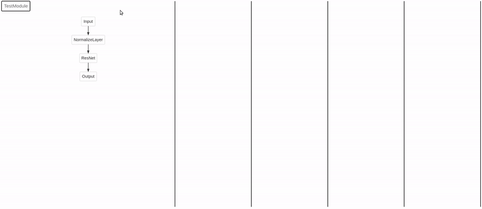

<p align="center">

</p>

<div align="center">

  <a href=""></a>
  <a href=""></a>
  <a href="https://github.com/spfrommer/torchexplorer/blob/main/LICENSE"></a>

</div>

<p align="center">
<em> Made by <a href="https://sam.pfrommer.us/">Samuel Pfrommer</a> as part of <a href="https://www2.eecs.berkeley.edu/Faculty/Homepages/sojoudi.html">Somayeh Sojoudi's group</a> at Berkeley. </em>
</p>

<p align="center">
  
</p>

<p align="center">
<em> <a href="https://api.wandb.ai/links/spfrom_team/8qqsxx9f">Try it yourself.</a>  </em>
</p>

Curious about what's happening in your network? TorchExplorer is a simple tool that allows you to interactively inspect the inputs, outputs, parameters, and gradients for each `nn.Module` in your network. It integrates with [weights and biases](https://wandb.ai/site) and can also operate locally as a standalone solution. If your use case fits (see limitations below), it's very simple to try:

```python
model = ...

torchexplorer.watch(model, backend='wandb') # Or 'standalone'

# Training loop...
```

For full usage examples, see `/tests` and `/examples`. 

### Install
Installing requires one external `graphviz` dependency, which should be available on most package managers.

```bash
sudo apt-get install libgraphviz-dev graphviz
pip install torchexplorer
```

### User interface
**Explorer.** The left-hand panel contains a module-level graph of your network architecture, automatically extracted from the autograd graph. Clicking on a module will open its "internal" submodules. To return to a parent module, click on the appropriate element in the top-left expanding list.

**Panels.** To inspect a module in more detail, just drag and drop it into one of the columns on the right. The histogram colors don't represent anything intrinsically—they're just to help identify in the explorer which modules are being visualized.

**Histograms.** Each vertical "slice" of a histogram encodes the distribution of values at the corresponding x-axis time. The y-axis displays the minimum / maximum bounds of the histogram. Completely white squares mean that no data fell in that bin. A bin with one entry will be shaded light gray, with the color intensifying as more values fall in that bin (this encodes the "height" of the histogram). The dashed horizontal line is the $y=0$ line.

For the following explanations, I'll be referencing this module:
```python
class TestModule(nn.Module):
    def __init__(self):
        super().__init__()
        self.fc = nn.Linear(20, 20)
        self.activation = nn.ReLU()

    def forward(self, x):
        x1 = self.fc(x)
        x2 = self.activation(x1)
        return x2  
```

_Input/output histograms._ These histograms represent the values passed into and out of the module's `forward` method, captured using hooks. For instance, if we are visualizing the `fc` layer in the above `TestModule`, the `input 0` histogram will be the histogram of `x`, and the `output 0` histogram will be the histogram of `x1`. If `fc` accepted two inputs `self.fc(x, y)`, then the histogram would show `input 0` and `input 1`. Note that the `input 0` histogram on the `activation` module will look very close to the `output 0` histogram on the `fc` module, with some small differences due to random sampling.

_Input/output gradient norm histograms._ These histograms capture tensor gradients from `backward` passes through the module. Unlike parameter gradients, we record here the $\ell_2$-norm of the gradients, averaged over the batch dimension. This means that if the gradient of the loss with respect to the module input is of dimension $b \times d_1 \times d_2$, we first flatten to a $b \times (d_1 \cdot d_2)$ vector and take the row-wise norm to get a length $b$ vector. These values then populate the histogram. For the `fc` layer in the above example, `input 0 (grad norm)` would apply this procedure to the gradient of the loss with respect to `x`, while `output 0 (grad norm)` would apply this procedure to the gradient of the loss with respect to `y`.

_Parameter histograms._ After the input/output histograms are extracted, all submodules will have their immediate parameters (`module._parameters`) logged as histograms. Note that this is not the same as `module.parameters()`, which would also recurse to include all child parameters. Some modules (particularly activations) have no parameters and nothing will show up in the interface. For instance, `TestModule` above has no trainable immediate parameters; `fc` will have `weight` and `bias` parameters; and `activation` will again have nothing.

_Parameter gradient histograms._ After the `backward` call is completed, each parameter will have a `.grad` attribute storing the gradient of the loss with respect to that parameter. This tensor is directly passed to the histogram. Unlike the input/output gradients, no norms are computed.

## API 

The api surface is just one function call, inspired by wandb's [watch](https://docs.wandb.ai/ref/python/watch).

```python
def watch(
    module: nn.Module,
    log: list[str] = ['io', 'io_grad', 'params', 'params_grad'],
    log_freq: int = 100,
    ignore_io_grad_classes: list[type] = [],
    disable_inplace: bool = False,
    bins: int = 10,
    sample_n: int = 100,
    reject_outlier_proportion: float = 0,
    time_log: tuple[str, Callable] = ('step', lambda module, step: step),
    backend: Literal['wandb', 'standalone', 'none'] = 'wandb',
    standalone_dir: str = './torchexplorer_standalone',
    standalone_port: int = 5000,
    verbose: bool = True,
) -> StructureWrapper:
"""Watch a module and log its structure and histograms to a backend.

Args:
    module (nn.Module): The module to watch.
    log (list[str]): What to log. Can be a subset of
        ['io', 'io_grad', 'params', 'params_grad'].
    log_freq (int): How many backwards passes to wait between logging.
    ignore_io_grad_classes (list[type]): A list of classes to ignore when logging
        io_grad. This is useful for ignoring classes which do inplace operations,
        which will throw an error.
    disable_inplace (bool): disables the 'inplace' attribute for all activations in
        the module.
    bins (int): The number of bins to use for histograms.
    sample_n (int): The number of tensor elements to randomly sample for histograms.
    reject_outlier_proportion (float): The proportion of outliners to reject when
        computing histograms, based on distance to the median. 0.0 means reject
        nothing, 1.0 means reject everything
    time_log: ([tuple[str, Callable]): A tuple of (time_unit, Callable) to use for
        logging. The allable should take in the module and step and return a value
        to log. The time_unit string is just the axis label on the histogram graph.
        If "module" is a pytorch lightning modules, torchexplorer.LIGHTNING_EPOCHS
        should work to change the time axis to epochs.
    backend (Literal['wandb', 'standalone', 'none']): The backend to log to. If
        'wandb', there must be an active wandb run. Otherwise, a standalone web app
        will be created in the standalone_dir.
    standalone_dir (str): The directory to create the standalone web app in. Only
        matters if the 'standalone' backend is selected.
    standalone_port (int): The port to run the standalone server on. Only matters if
        the 'standalone' backend is selected.
    verbose (bool): Whether to print out standalone server start message.
"""
```

## Features and limitations

Notes on some corner cases. If something isn't covered here, feel free to open a GitHub issue.

### Supported

1. Performing multiple invocations of the same module is supported. Inputs/outputs will be displayed separately for each invocation, but the parameters and parameter gradients will of course be shared. So something like this should work:
```python
class TestModule(nn.Module):
    def __init__(self):
        super().__init__()
        self.fc = nn.Linear(20, 20)
        self.activation = nn.ReLU()

    def forward(self, x):
        x = self.activation(x)
        x = self.fc(x)
        x = self.activation(x)
        return x  
```
2. Nondifferentiable operations which break the autograd graph are permissible and should not cause a crash. However, the resulting module-level graph will be correspondingly disconnected.

### Unsupported

1. Having multiple `.backward()` calls in one training step is not supported.
2. **Recursive operations are not supported,** and **anything which dynamically changes the module-level control flow over training is not supported**. For instance, something like this isn't permissible:
```python
if x > 0:
    return self.module1(x)
else:
    return self.module2(x)
```
3. **Inplace operations are not supported** and should be corrected or filtered (see "Common errors" below).
4. Keyword tensor arguments to the `forward` method are not supported. Only positional arguments will be tracked. Behavior for keyword tensor arguments is untested as of now.

### Other notes

1. When invoking a module, **don't use the `module.forward(x)` method**. Always call the forward method as `module(x)`. The former does not call the hooks that `torchexplorer` uses.
2. Histograms will only be updated during _training_, not validation. This is directly checked using `module.training`. This means that if your validation dataset has a different distribution than your training dataset, what you see in the tool might not tell you what's going on during validation.

## Common errors

This section includes some errors that I've run into. For something not covered here, feel free to open a GitHub issue.


**1. Inplace operations in the computational graph**
 
```
RuntimeError: Output 0 of BackwardHookFunctionBackward is a view and is being modified inplace...
```

This indicates that an inplace operation is occurring somewhere in the computational graph, which messes with the input/output gradient capturing (`io_grad`) feature. This commonly comes from inplace activations (e.g. `nn.ReLU(inplace=True)`), or residual inplace additions (e.g. `out += identity`). If you don't care about gradients you can just omit `'io_grad'` in `log` argument to the `watch` function. Otherwise, there are two additional tools available. You can use the `disable_inplace` argument to automatically turn off the `inplace` flag on all activations. If this still doesn't cut it, you must figure out what submodules are doing inplace operations and either manually fix them or pass those classes to the `ignore_io_grad_classes` argument. For example, the `BasicBlock` in the torchvision resnet implementation has an inplace residual connection. So we would do the following:


```python
model = torchvision.models.resnet18(pretrained=False)
watch(
    model,
    disable_inplace=True,
    ignore_io_grad_classes=[torchvision.models.resnet.BasicBlock]
)
```


**2. Weights and biases chart glitches**
```
"No data available." in the Custom Chart.
```

This occasionally shows up for me in the weights and biases interface and seems to be a difficult-to-reproduce bug in their custom charts support. Sometimes waiting fixes it. If possible, just restarting training when you notice this.

```
"Something went wrong..." and Google Chrome crashes.
```

It happens occasionally that the wandb website crashes with torchexplorer active. Reloading the page seems to always work.

**3. Graphviz overflow errors**
```
"Trapezoid overflow" error in the graphviz call.
```
This is a [known bug](https://github.com/ellson/MOTHBALLED-graphviz/issues/56) in Graphviz 2.42.2, an ancient version which is still the default on most package managers. If you're getting this error, you can fix it by installing a [newer release](https://gitlab.com/graphviz/graphviz/-/releases).
